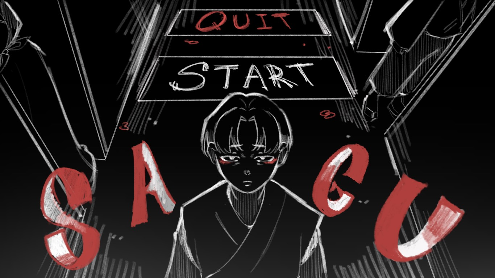

# ***SAGU***

**SAGU** is a horror game developed using **GameMaker Studio 2**, created as a final project for **JPN 40302: Contemporary Culture of Horror in Japan**.

It incorporates influence from works like *Kairo* and *Audition*, and other horror works. References from these works are found within the game as assets.

---

## 📂 Play the Game

The game is playable online via **GX.games** at:

🔗 [https://gx.games/games/fxup4v/sagu/tracks/2e54bd20-7e00-43ae-84b1-741e3e26e72e/](https://gx.games/games/fxup4v/sagu/tracks/2e54bd20-7e00-43ae-84b1-741e3e26e72e/)

*Note: The game is optimized for desktop browsers. MacOs and Windows applications cannot be created for now due to signing issues (not having the proper certs to create apps)*

---

## 🎮 Controls

| Action                     | Key                    |
|----------------------------|------------------------|
| Start Game                  | `SPACE`                |
| Move Character              | `WASD`                 |
| Interact / Progress Dialogue | `SPACE` (when near NPC or object) |
| Advance Dialogue Faster     | `SPACE` (while dialogue is shown) |

---

## Write Up

A writeup of the game and a bit on the development process + creative process can be found here: 🔗 [https://docs.google.com/document/d/11MjJmCgeNzaJrsKwdFaz76Mh2Hh2lSDrL8DvBSvhxLM/edit?tab=t.0](https://docs.google.com/document/d/11MjJmCgeNzaJrsKwdFaz76Mh2Hh2lSDrL8DvBSvhxLM/edit?tab=t.0)

## Walkthrough
<video width="640" height="360" controls>
  <source src="datafiles/walkthrough.mp4" type="video/mp4">
</video>
## 👤 Credits

- **Developer**: Gustavo Grijalba Chavez
- **Course**: JPN 40302: Contemporary Culture of Horror in Japan
- **Tools Used**: GameMaker Studio 2, GX.games
- **Artists**: Yuki Ye, Jessica Flores Olmos